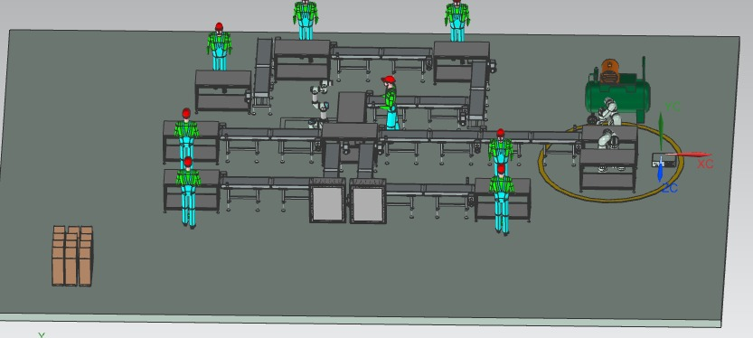

<picture>
    <source srcset="https://imgur.com/5bYAzsb.png" media="(prefers-color-scheme: dark)">
    <source srcset="https://imgur.com/Os03JoE.png" media="(prefers-color-scheme: light)">
    
</picture>

<h3>AUTOMATIZACIÓN DE PROCESOS DE MANUFACTURA</h3>

<h1>Módulo 6 - Virtualización de fábrica</h1>

<h2>Mep Mep Raideres</h2>

<h5>Joan Sebastian Arcila  
    Juan Sebastian Daleman Martinez 
    Daniel Santiago Muñoz Bernal 
    Maria Alejandra Pérez Petro 
    Emma Carolina Sarmiento Cabarcas</h5>

<h6>Universidad Nacional de Colombia 
    Facultad de Ingeniería 
    Departamento de Ingeniería Mecánica y Mecatrónica 
    Bogotá, Colombia 
    2025</h6>

    
🗂️ Tabla de Contenido

<!-- TOC -->
- [1. 📄 Documentación del Proceso de Virtualización con NX Mechatronics Concept Designer](#1--documentación-del-proceso-de-virtualización-con-nx-mechatronics-concept-designer)
  - [1.1. ✍🏻🏭🖥️ Diseño de la Planta Virtual](#11-️-diseño-de-la-planta-virtual)
  - [1.2. 📄🖥️ Descripción General del Sistema Virtualizado](#12-️-descripción-general-del-sistema-virtualizado)
  - [1.3. 🏗️ Propiedades Físicas](#13-️-propiedades-físicas)
  - [1.4. 📡🦾 Sensores y Actuadores](#14--sensores-y-actuadores)
  - [1.5. 🎛️⚙️ Adaptador de Señales y Configuración de Simulación](#15-️️-adaptador-de-señales-y-configuración-de-simulación)
  - [1.6. 🏙️ Referencia Audiovisual](#16-️-referencia-audiovisual)

# 1. 📄 Documentación del Proceso de Virtualización con NX Mechatronics Concept Designer

## 1.1. ✍🏻🏭🖥️ Diseño de la Planta Virtual

Para la virtualización del sistema se usó el entorno de modelado de **NX Mechatronics Concept Designer**, donde se diseñaron dos versiones del sistema:

* Una versión detallada con todos los elementos físicos de la planta real.
* Una versión **simplificada** para facilitar la simulación en tiempo real sin comprometer el desempeño del sistema.

Cada una de las 7 bandas transportadoras fue equipada con dos sensores que detectan la presencia de elementos en tránsito. Estas bandas y sensores fueron representados como **cuerpos rígidos**, sensores de proximidad virtuales, y actuadores asociados.

    

> Planta detallada creada en NX MCD con todos los componentes visibles.

    

> Planta optimizada para simulaciones funcionales. Esta versión fue la usada durante las pruebas con señales reales.

## 1.2. 📄🖥️ Descripción General del Sistema Virtualizado

El sistema virtualizado representa una línea de producción automatizada para el ensamblaje y control de calidad de **patinetas**. Está compuesto por siete bandas transportadoras (`Banda1` a `Banda7`) que trasladan componentes y productos terminados a lo largo de la celda. Se incluyen estaciones de ensamblaje (`PatinetaAsm`), control de calidad (`PatinetaCalidad`) y empaquetado (`PatinetaEmpaquetado`).

Los elementos están organizados jerárquicamente en el entorno de física básica de NX MCD, permitiendo una simulación realista de movimiento, interacción de cuerpos y secuencia operativa.

## 1.3. 🏗️ Propiedades Físicas

* Aplicación de cuerpos rígidos y de colision para componentes de patinetas y las bandas.

## 1.4. 📡🦾 Sensores y Actuadores

Cada banda (`Banda1` a `Banda7`) cuenta con sensores de activación y paro:

* **StartBandaX**: señal que permite activar el movimiento de la banda.
* **StopBandaX**: señal que permite detener el movimiento.

Estas señales están asociadas a condiciones de proceso definidas por sensores virtuales dentro del entorno de NX MCD.

## 1.5. 🎛️⚙️ Adaptador de Señales y Configuración de Simulación

Para lograr la conexión entre la lógica interna del sistema virtualizado y las señales externas, se utilizó un adaptador de señales. Este componente permite asociar señales virtuales con variables accesibles desde sistemas externos.

El adaptador tomó valores enteros y los uitlizo en condiciones logicas para cambiar los valores de los parametros booleanos.

## 1.6. 🏙️ Referencia Audiovisual

En el video del proyecto se puede encontrar con más detalle la configuración de las señales y la forma de comunicación. Para ver específicamente esa parte, haz clic en la imagen.

  

